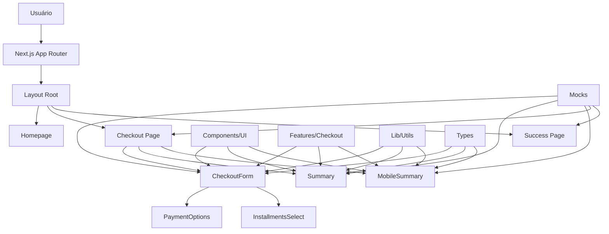
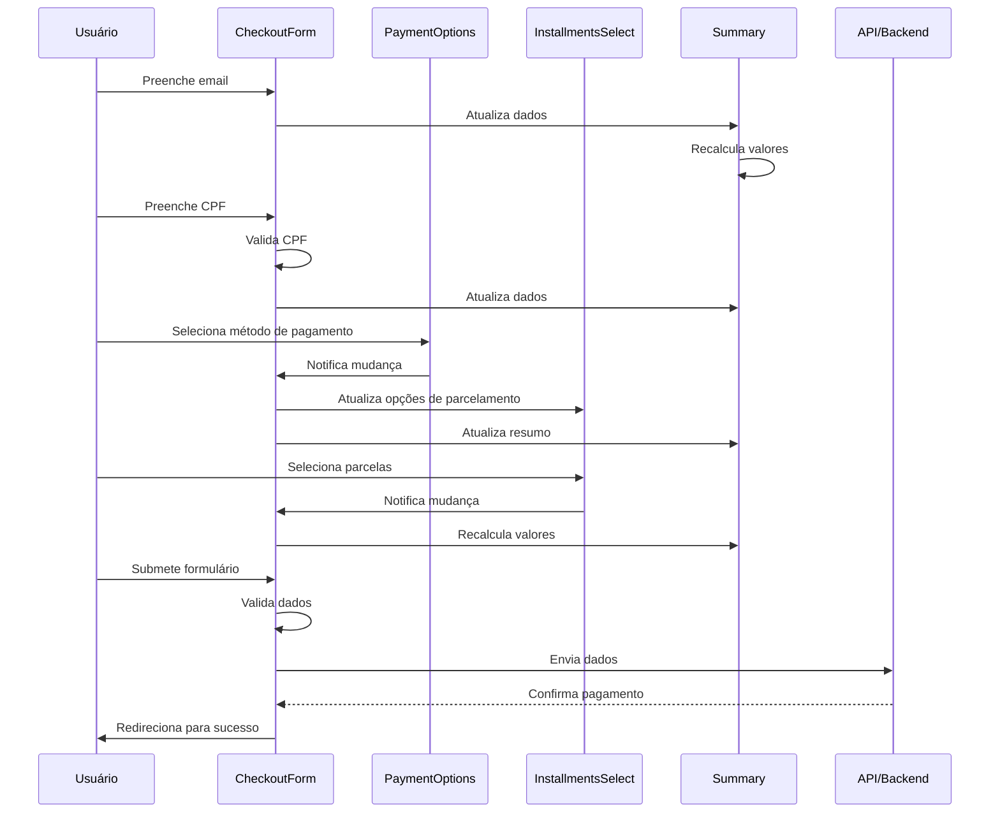
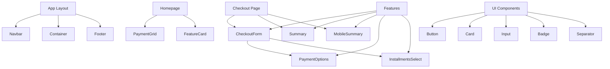
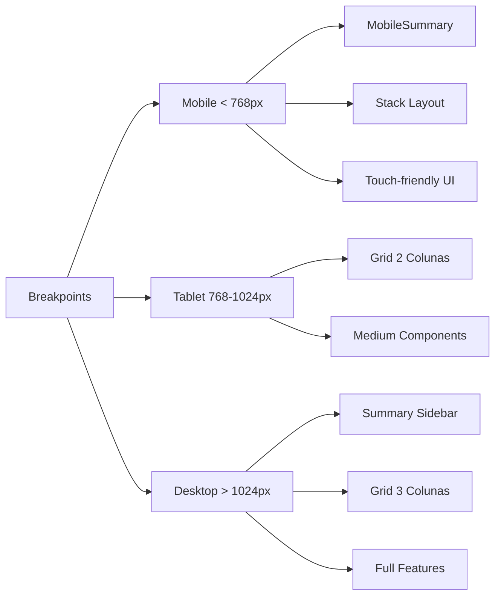
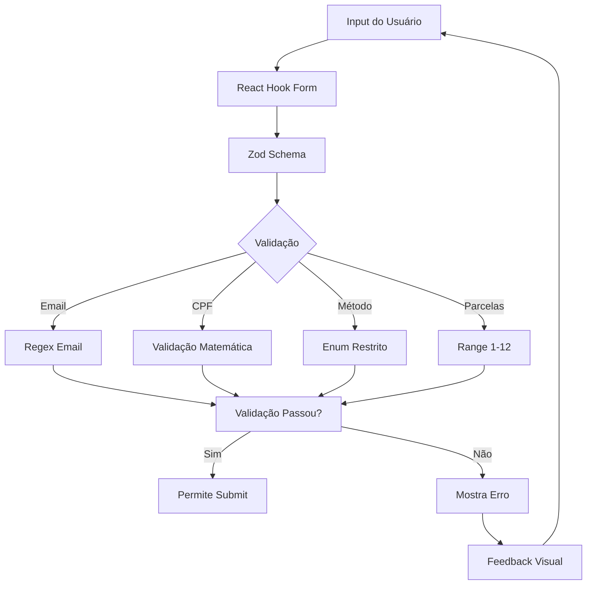
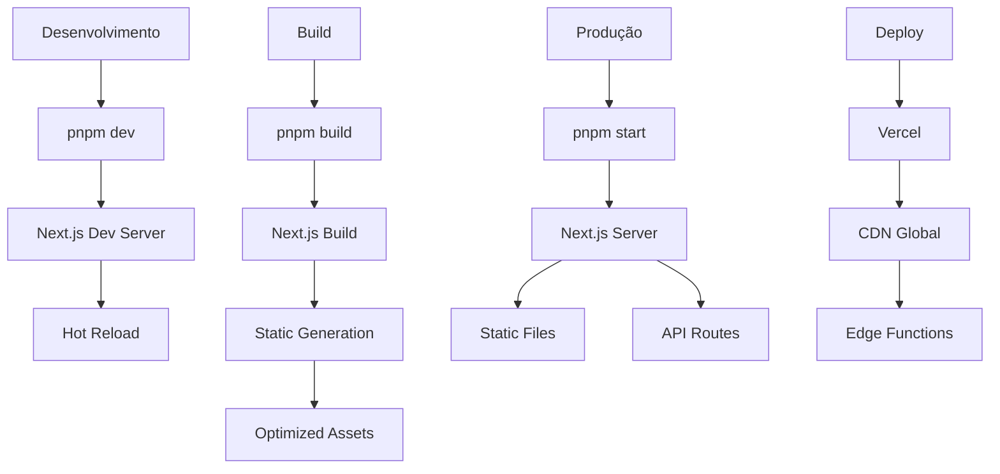
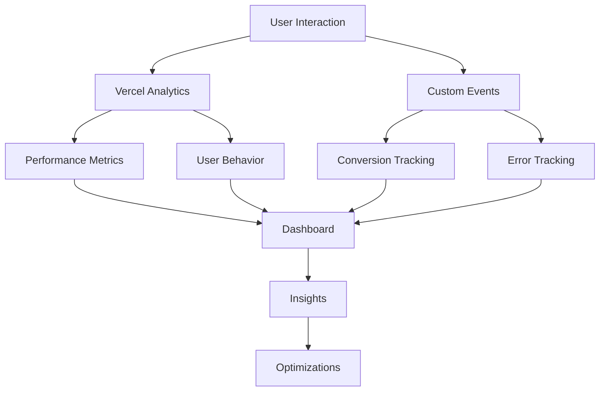
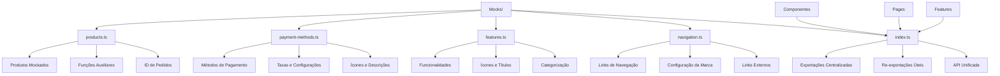
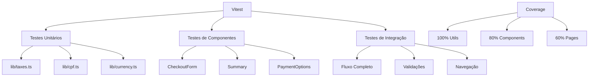

# Diagramas de Arquitetura - Cakto Frontend

## 🏗️ Arquitetura Geral do Sistema



## 🔄 Fluxo de Dados do Checkout



## 🎨 Estrutura de Componentes



## 💰 Sistema de Cálculos

```mermaid
flowchart TD
    A[Valor do Produto] --> B{Método de Pagamento}
    B -->|PIX| C[Taxa: 0%]
    B -->|Cartão| D[Taxa: 3.99% + 2% por parcela extra]

    C --> E[Total = Valor Original]
    D --> F[Total = Valor × (1 + Taxa)]

    E --> G[Valor Líquido = Valor Original]
    F --> H[Valor Líquido = Valor Original - Taxa]

    I[Parcelas] --> J[Valor da Parcela = Total ÷ Parcelas]

    G --> K[Resumo Final]
    H --> K
    J --> K
```

## 📱 Responsividade



## 🔒 Validações e Segurança



## 🚀 Deploy e Build



## 📊 Monitoramento e Analytics



## 📦 Estrutura de Mocks



## 🧪 Estrutura de Testes



---

_Estes diagramas representam a arquitetura atual do sistema Cakto e podem ser atualizados conforme o projeto evolui._
